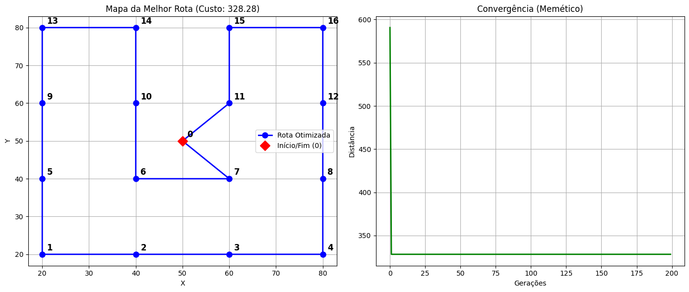

# 🧬 Traveling Salesperson Problem (TSP) with Memetic Algorithms

Este projeto implementa uma solução para o clássico **Problema do Caixeiro Viajante (TSP)** utilizando uma abordagem **Memética (Híbrida)**.

Diferente de Algoritmos Genéticos puros, a abordagem Memética combina a evolução global com técnicas de **Busca Local (Local Search)**, permitindo que os indivíduos "aprendam" e refinem suas rotas durante o processo evolutivo.

## 🎯 O Desafio
Minimizar a distância Euclidiana total percorrida para visitar 17 cidades (com coordenadas fixas) e retornar ao ponto de partida, sem repetições.

## 🧠 Arquitetura do Algoritmo

O modelo utiliza uma estratégia híbrida focada em convergência rápida e qualidade de solução:

### 1. Componente Evolutivo (Global Search)
* **Representação:** Permutação de inteiros (Path Representation).
* **Crossover:** Utilizamos o **OX1 (Order Crossover)** para garantir que a ordem relativa das cidades seja preservada e evitar rotas inválidas.
* **Mutação:** Swap Mutation (Troca simples) para manter a diversidade genética.
* **Elitismo:** Preservação dos top-5 melhores indivíduos de cada geração.

### 2. Componente Memético (Local Search)
* **Técnica:** Algoritmo **2-Opt**.
* **Funcionamento:** O algoritmo verifica cruzamentos de arestas na rota e os "desembaraça" invertendo segmentos do caminho.
* **Aprendizado Lamarckiano:** As melhorias obtidas pela busca local são incorporadas ao genoma do indivíduo e passadas para as próximas gerações.

## 🛠️ Tecnologias
* **Python 3.10+**
* **NumPy:** Cálculos vetoriais de distância.
* **Matplotlib:** Visualização da rota e convergência.

## 📊 Resultados

O algoritmo demonstra alta eficiência na convergência devido à pressão seletiva híbrida.

* **Instância:** 17 Cidades.
* **População:** 100 indivíduos.
* **Gerações:** 200.
* **Pressão Memética:** 50% de chance de Busca Local por indivíduo.

## 👥 Author & Context

Developed by **José Henrique (Nean)** as a final challenge for the **LIAO - Liga Acadêmica de Inteligência Artificial e Otimização (UFBA)**.

* **Role:** Full implementation (Algorithm logic, Genetic Operators, Local Search optimization).
* **Course Context:** Introduction to Computer Engineering / AI League.

---
*License: MIT*

